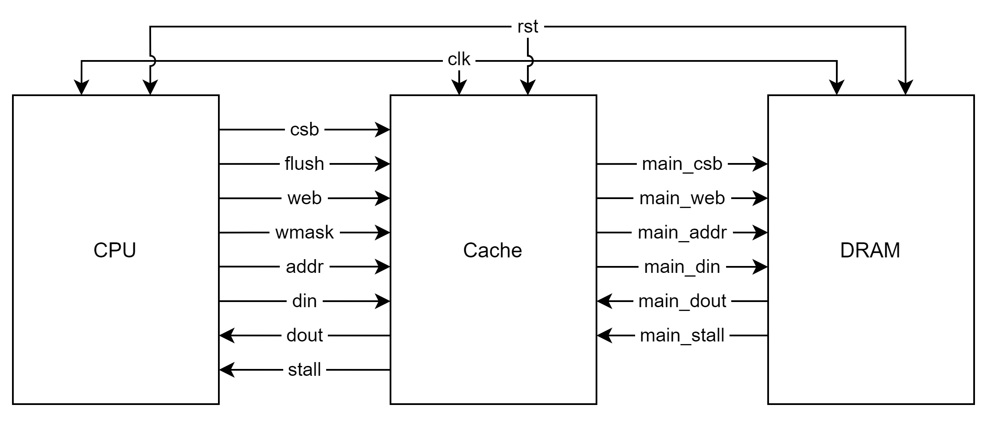

# Documentation
This serves as the documentation of OpenCache that explains how generated caches work.

# Cache Ports

| Pin | Size | Description |
| - | - | - |
| `clk` | 1-bit | Clock |
| `rst` | 1-bit | Reset |
| `csb` | 1-bit | Chip Select (Active Low) |
| `web` | 1-bit | Write Enable (Active Low) |
| `addr` | n-bit | Address |
| `din` | w-bit | Data Input |
| `dout` | w-bit | Data Output |
| `stall` | 1-bit | Stall |

# Cache States

## RESET
This is the initial state and a multi-cycle reset. It sets all rows of the internal
arrays to 0. Cache enters this state when `rst` signal is high. Until it exits the
state, `stall` signal stays high. After reset is over, cache switches to **IDLE** state.

## IDLE
Cache reads the address input and requests **tag** and **data** lines from its internal
SRAM arrays. `stall` signal is not low in this state since we want to fill the pipeline.
If `csb` input is high (means no request), cache waits in this state. Otherwise, cache
switches to **CHECK** state.

## CHECK
**Tag** and **data** lines are returned by internal SRAM arrays. Cache checks whether
the request is a hit or miss.

* If it is a hit, cache immediately performs the request (returns data if read, writes
input if write). If `csb` is low, it also reads the next address from the pipeline and
requests corresponding **tag** and **data** lines from internal arrays. If the next
address is in the same set with the current address and current request is write (data
needs to be updated), **data hazard** might occur. In this case, cache uses *“bypass registers”*
so that it can use up-to-date data in the next cycle. If `csb` is high, cache switches to
**IDLE** state; otherwise, it stays in this state. `stall` signal stays low to keep the
pipeline running.

* If it is a miss, cache checks whether the data line is dirty or not. In either case,
`stall` becomes high since cache will wait for the main memory's response.

    * If the data line is dirty, cache sends the dirty line to the main memory. Cache
switches to **WRITE** state if main memory's `stall` signal is low. Otherwise, it switches
to **WAIT_WRITE** state.

    * If the data line is not dirty, cache requests the new data line from the main
memory. Cache state switches to **READ** state if main memory's `stall` signal is low.
Otherwise, it switches to **WAIT_READ** state.

## WAIT_WRITE
Cache waits in this state until main memory's `stall` signal is low. When it is low,
cache switches to **WRITE** state.

## WRITE
Cache waits in this state until main memory’s `stall` signal becomes low. When it is
low, cache requests the new data line from the main memory. `stall` signal stays high.
Cache switches to **READ** state.

## WAIT_READ
Cache waits in this state until main memory's `stall` signal is low. When it is low,
cache switches to **READ** state.

## READ
Cache waits in this state until main memory’s `stall` signal becomes low. When it is
low, cache sends new **tag** and **data** lines to internal SRAM arrays. If `csb` is low,
cache reads the next address from the pipeline and requests corresponding **tag** and
**data** lines from internal SRAM arrays. It avoids data hazard just like **CHECK** state.
If `csb` is high, cache switches to **IDLE** state; otherwise, it switches to **CHECK**
state.