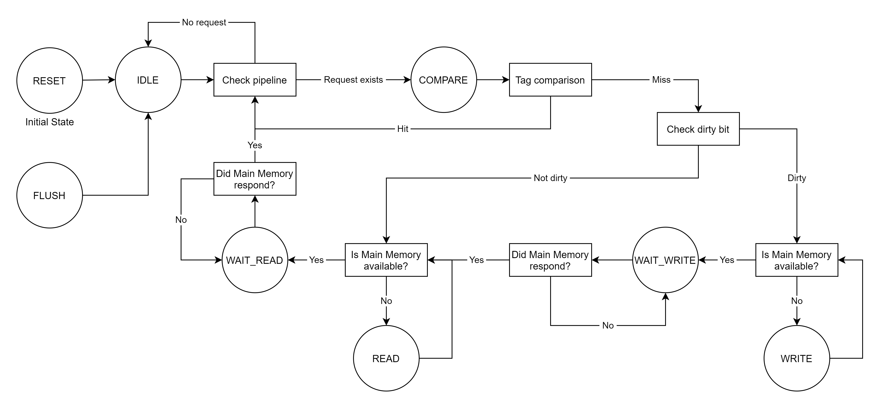

# Documentation
This serves as the documentation of OpenCache that explains how generated caches work.

# Cache Ports

| CPU Port  |           |                           | DRAM Port    |           |                           |
| --------- | :-------: | ------------------------- | ------------ | :-------: | ------------------------- |
| **Pin**   | **Size**  | **Description**           | **Pin**      | **Size**  | **Description**           |
| `clk`     | 1-bit     | Clock                     | `clk`        | 1-bit     | Clock                     |
| `rst`     | 1-bit     | Reset                     | `rst`        | 1-bit     | Reset                     |
| `flush`   | 1-bit     | Flush                     | `main_csb`   | 1-bit     | Chip Select (Active Low)  |
| `csb`     | 1-bit     | Chip Select (Active Low)  | `main_web`   | 1-bit     | Write Enable (Active Low) |
| `web`     | 1-bit     | Write Enable (Active Low) | `main_addr`  | n-bit     | Address                   |
| `wmask  ` | (w/8)-bit | Write mask                | `main_din`   | w-bit     | Data Input                |
| `addr`    | n-bit     | Address                   | `main_dout`  | w-bit     | Data Output               |
| `din`     | w-bit     | Data Input                | `main_stall` | 1-bit     | Stall                     |
| `dout`    | w-bit     | Data Output               |
| `stall`   | 1-bit     | Stall                     |

# Cache States

## RESET
This is the initial state and a multi-cycle reset. It sets all rows of the internal
arrays to zero. Cache enters this state when `rst` signal is high. Until it exits
the state, `stall` signal stays high. After the reset is over, cache switches to the
**IDLE** state and `stall` becomes low.

## FLUSH
This state is independent from other states. If `flush` signal is high, cache enters
this state. `stall` signal becomes high and cache starts writing all dirty data lines
back to DRAM. When all data lines are written back to DRAM, cache switches to the
**IDLE** state if `csb` is high; otherwise, it switches to the **COMPARE** state.

## IDLE
In this state, cache reads `addr` input and requests tag and data lines from its
internal SRAM arrays. If `csb` input is high, cache waits in this state. Otherwise,
cache switches to the **COMPARE** state.

## COMPARE
Tag and data lines are returned by the internal SRAM arrays. Cache checks whether 
the request is a hit or miss.

If it is a hit, cache immediately performs the request; returns the data if read,
writes the input if write. If `csb` is low, it also reads the next address from the
pipeline and requests corresponding tag and data lines from the internal SRAM arrays.
If the next address is in the same set with the current address and current request
is write (data line needs to be updated), data hazard might occur. In this case,
cache uses bypass registers so that it can use up-to-date data in the next cycle.
If `csb` is high, cache switches to the **IDLE** state; otherwise, it stays in this
state. stall signal stays low to keep the pipeline running

If it is a miss, cache checks whether the data line is dirty or not. In either case,
`stall` becomes high since cache will wait for DRAM’s response.

If the data line is dirty, cache sends the dirty line to DRAM. Cache switches to the
**WAIT_WRITE** state if DRAM’s `main_stall` signal is low. Otherwise, it switches to
the **WRITE** state.

If the data line is not dirty, cache requests the new data line from DRAM. Cache
switches to the **WAIT_READ** state if `main_stall` signal is low. Otherwise, it
switches to the **READ** state.

## WRITE
Cache waits in this state until `main_stall` signal is low. When it is low, cache
sends the dirty line to DRAM and switches to the **WAIT_WRITE** state.

## WAIT_WRITE
Cache waits in this state until `main_stall` signal becomes low. When it is low,
cache requests the new data line from DRAM. `stall` signal stays high. Cache switches
to the **WAIT_READ** state.

## READ
Cache waits in this state until `stall` signal is low. When it is low, cache requests
the new data line from DRAM and switches to the **WAIT_READ** state.

## WAIT_READ
Cache waits in this state until `main_stall` signal becomes low. When it is low, cache
sends the new tag and data lines to the internal SRAM arrays. If `csb` is low, cache
reads the next address from the pipeline and requests corresponding tag and data lines
from the internal SRAM arrays. It avoids data hazard similar to the **COMPARE** state.
If `csb` is high, cache switches to the **IDLE** state; otherwise, it switches to the
**COMPARE** state.