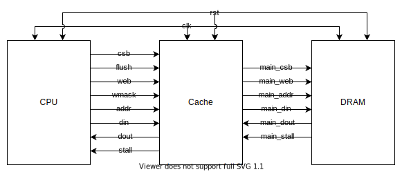

# Cache Ports

| CPU Port  |           |                           | DRAM Port    |           |                           |
| --------- | :-------: | ------------------------- | ------------ | :-------: | ------------------------- |
| **Pin**   | **Size**  | **Description**           | **Pin**      | **Size**  | **Description**           |
| `clk`     | 1-bit     | Clock                     | `clk`        | 1-bit     | Clock                     |
| `rst`     | 1-bit     | Reset                     | `rst`        | 1-bit     | Reset                     |
| `flush`   | 1-bit     | Flush                     | `main_csb`   | 1-bit     | Chip Select (Active Low)  |
| `csb`     | 1-bit     | Chip Select (Active Low)  | `main_web`   | 1-bit     | Write Enable (Active Low) |
| `web`     | 1-bit     | Write Enable (Active Low) | `main_addr`  | n-bit     | Address                   |
| `wmask  ` | (w/8)-bit | Write mask                | `main_din`   | w-bit     | Data Input                |
| `addr`    | n-bit     | Address                   | `main_dout`  | w-bit     | Data Output               |
| `din`     | w-bit     | Data Input                | `main_stall` | 1-bit     | Stall                     |
| `dout`    | w-bit     | Data Output               |
| `stall`   | 1-bit     | Stall                     |